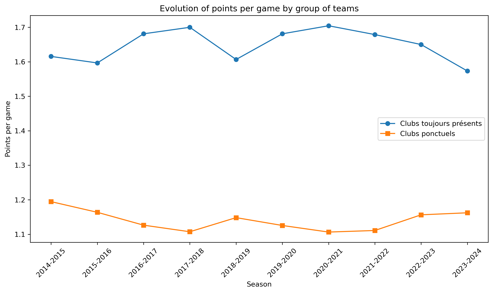
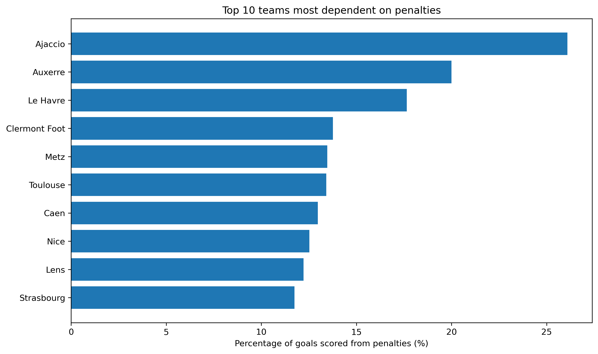

# 📊 Ligue 1 Performance Analysis (2014–2024)

This project provides an exploratory data analysis of team performances in France’s Ligue 1 over the last decade. The analysis is conducted season by season and by club, and includes both descriptive statistics and predictive modeling to understand what drives success in the French top division.

---

## 🧭 Introduction

This project explores team performance in Ligue 1 from the 2014–2015 season through 2023–2024. The goals are:
- To identify the statistical patterns and indicators associated with team success.
- To compare consistently present clubs with promoted/relegated teams.
- To model the probability of finishing in the Top 3 using team stats.
- To visualize trends in possession, scoring, and defense.

---

## 📁 Project Structure

```
ligue1-performance-analysis/
│
├── data/                         # Contains raw dataset (CSV)
│   └── ligue-1-stat-15-24.csv
│
├── notebooks/                   # Main analysis notebook
│   └── Project_1_Ligue1_documented.ipynb
│
├── figures/                     # Exported visualizations (optional)
│   └── *.png
│
├── README.md                    # Project overview and usage instructions
├── .gitignore                   # Git tracking exclusion file
└── LICENSE                      # MIT License for open-source usage

```

---

## 🚀 Usage Instructions

To reproduce the analysis:

1. Clone the repository:
```bash
git clone https://github.com/AntoineLonguevre/ligue1-performance-analysis.git
cd ligue1-performance-analysis
```

2. Install the required Python libraries (if not already available):
```bash
pip install -r requirements.txt
```

3. Open the Jupyter Notebook:
```bash
jupyter notebook notebooks/Project_1_Ligue1_documented.ipynb
```

4. Run the notebook step by step. It includes all data loading, cleaning, visualizations, and model training.

---

## 📊 Key Outputs and Visualizations

Here are some of the visual deliverables and insights included:

- 📈 **Points per match evolution** by club type (always present vs. promoted).

This plot highlights the structural gap in performance between clubs that remained in Ligue 1 throughout the decade and those that were promoted or relegated.



- ### 🎯 Predicting Top 3 Finishes – Random Forest

The model assigns a probability of finishing in the Top 3 to every team-season based on performance stats. 


- ### 🧠 Team Profiles: Radar Comparison

Radar charts show performance on key dimensions (goals scored/conceded, possession, clean sheets). PSG dominates across the board, while other top teams show more varied profiles.


- ### ⚖️ Efficiency Grid: Offensive vs Defensive Strength

This scatterplot combines normalized offensive and defensive indicators. It reveals teams that are strong in both areas — or unbalanced.


- ### 🎯 Penalty Dependency Ratio

Which teams rely most on penalties for their goal scoring? This metric helps identify tactical trends or weaknesses in open play.



---

## 🧠 Conclusion

The analysis highlighted:
- The consistent dominance of PSG across all metrics.
- The emergence of Lens and Lille as efficient performers.
- That possession alone is not a sufficient predictor of success.
- That goals for, goals against, and clean sheets are the most impactful stats.

This project sets the stage for deeper season simulations and interactive dashboards.

---

## ✍️ Author
Antoine Longuevre  
Feel free to contribute or suggest improvements via GitHub Issues or Pull Requests.

---

## 📜 License

This project is licensed under the [MIT License](./LICENSE).  
You are free to use, modify, and distribute this code with proper attribution.


